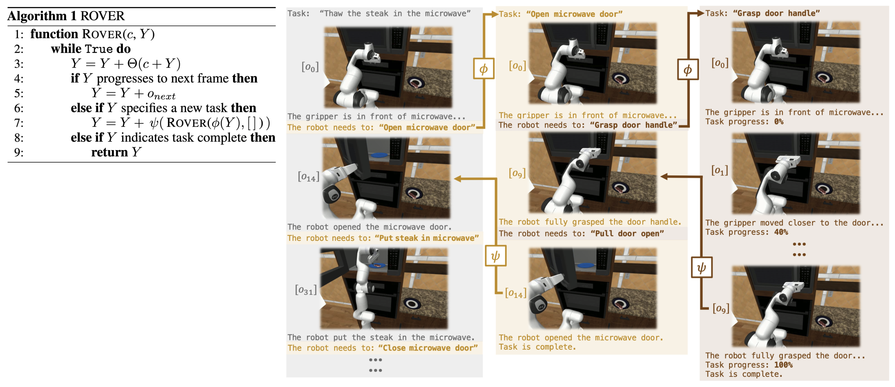

# ROVER: Recursive Reasoning Over Videos with Vision-Language Models for Embodied Tasks
This repository contains the official implementation of the methods proposed in the NeurIPS 2025 paper:

> ROVER: Recursive Reasoning Over Videos with Vision-Language Models for Embodied Tasks  
> Philip Schroeder, Ondrej Biza, Thomas Weng, Hongyin Luo, James Glass

ROVER is a framework for frame-level reasoning and task progress prediction over long-horizon embodied manipulation videos using vision-language models.

<p align="center">
  
</p>

---
### 📄 Paper (arXiv)
https://arxiv.org/abs/2508.01943

### 📄 Project page
https://rover-vlm.github.io

## 🚀 Quick Start

Below is a minimal example demonstrating how to run ROVER on a sequence of frames:
```python
from rover_model import (rover, process_rover_output)
import google.generativeai as genai
import glob

API_KEY = ...
genai.configure(api_key=API_KEY)
google_model = genai.GenerativeModel(model_name="gemini-2.5-pro")

frame_file_list = sorted(glob.glob("./test_video/frame_wrist_*.jpg"), key=lambda x: int(x.split('frame_wrist_')[-1].split('.jpg')[0]))
task_description = "Pick the cupcake from the counter and place it in the cabinet."
camera_view = "wrist view"

final_idx, subtask_list, subtask_progress_list, subtask_frame_descriptions_list, _ = rover(task_description, camera_view, frame_file_list)
final_progress_list, frame_descriptions_list = process_rover_output(subtask_list, subtask_progress_list, subtask_frame_descriptions_list)
```
---


## 🎥 Demos

Example videos demonstrating ROVER's frame-level reasoning and task progress prediction can be found at:

https://rover-vlm.github.io

---

## 📦 Evaluation Dataset

The evaluation dataset used in our experiments is publicly available:

https://drive.google.com/drive/folders/1Tj5lpItYeQ7hMKenBfs6iZACY168id8Y?usp=share_link

---
<!-- 
## 🔧 Installation

Clone the repository:

    git clone https://github.com/your-org/rover.git
    cd rover

Install dependencies:

    pip install -r requirements.txt

Note: This repository requires access to external vision-language model APIs (e.g., Gemini). You must configure your own API keys.

---

## 📁 Repository Structure

    rover/
    ├── rover_model.py
    ├── test_video/
    ├── requirements.txt
    └── README.md

--- -->

<!-- ## ⚙️ Configuration

Before running the model, configure your API key:

    import google.generativeai as genai
    genai.configure(api_key="YOUR_API_KEY")

You may modify the model selection as needed:

    google_model = genai.GenerativeModel(model_name="gemini-2.5-pro")

--- -->
## 🧩 Method Overview

ROVER performs recursive reasoning over video frames to:
- Decompose long-horizon embodied tasks into structured subtasks
- Track subtask-level progress over time
- Generate dense frame-level semantic descriptions
- Enable temporally consistent reasoning with vision-language models

This allows robust reasoning over partial observability and complex manipulation trajectories.

---

## 📊 Outputs

ROVER returns:

- final_idx: Final task completion index
- subtask_list: Predicted subtask decomposition
- subtask_progress_list: Progress over time per subtask
- subtask_frame_descriptions_list: Frame-level reasoning outputs
- final_progress_list: Aggregated task progress
- frame_descriptions_list: Dense semantic descriptions

These outputs enable both task monitoring and post-hoc interpretability.

---

## 📚 Citation

If you use ROVER in your research, please cite:

    @inproceedings{rover2025,
      title     = {ROVER: Recursive Reasoning Over Videos with Vision-Language Models for Embodied Tasks},
      author    = {Schroeder, Philip and Biza, Ondrej and Weng, Thomas and Luo, Hongyin and Glass, James},
      booktitle = {Advances in Neural Information Processing Systems (NeurIPS)},
      year      = {2025}
    }

---

## 📄 License

This project is released under the MIT License unless otherwise specified.  
See the LICENSE file for details.

---

## 🙋 Contact

For questions or issues, please open a GitHub Issue or contact the authors directly.

---


